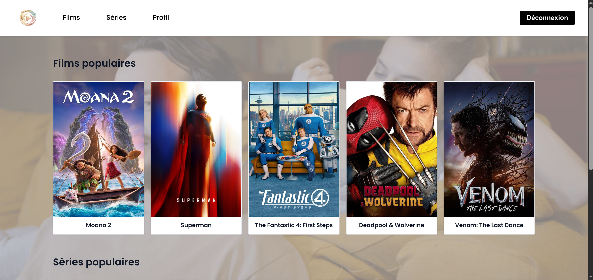

# Previously



  

Site de suivi de films et de séries développé dans le cadre d'un projet Epitech Web Academy. Previously permet de parcourir des films et séries, d'effectuer des recherches et d'accéder aux détails des contenus via une interface Nuxt connectée à l'API Betaseries.

---

## Prérequis

- [Node.js](https://nodejs.org/) 18+
- [Docker](https://www.docker.com/) (optionnel)
- Un compte [Betaseries](https://www.betaseries.com/en/registration)

---

## Installation

### 1. Cloner le dépôt

```bash
git clone git@github.com:YetAnotherLea/Previously.git
cd Previously
```

### 2. Obtenir une clé API Betaseries

1. Connectez-vous à votre compte Betaseries.
2. Rendez-vous sur [la page de gestion des clés API](https://www.betaseries.com/api/).
3. Remplissez le formulaire :
   - **Nom de votre application** : `Previously`
   - **Type** : `Projet personnel`
   - **URL de callback** : `http://localhost:3000/api/auth/oauth-callback`
4. Validez. Betaseries vous fournit un **client ID** et un **client secret**.

> Ne créez pas de compte avec Google. La redirection OAuth de Betaseries ne prend pas en charge ce type de connexion.

### 3. Configurer les variables d'environnement

Créez un fichier `.env` à la racine du projet :

```dotenv
NUXT_PUBLIC_BETASERIES_CLIENT_ID=votre_client_id
NUXT_BETASERIES_CLIENT_SECRET=votre_client_secret
NUXT_PUBLIC_APP_BASE_URL=http://localhost:3000
```

| Variable | Description |
|---|---|
| `NUXT_PUBLIC_BETASERIES_CLIENT_ID` | Clé publique fournie par Betaseries |
| `NUXT_BETASERIES_CLIENT_SECRET` | Clé secrète fournie par Betaseries |
| `NUXT_PUBLIC_APP_BASE_URL` | URL de base de l'application |

> Ne commitez jamais votre fichier `.env`. Il est listé dans `.gitignore` et `.dockerignore`.

### 4. Installer les dépendances et lancer le projet

```bash
npm install
npm run dev
```

L'application est accessible sur : `http://localhost:3000`

---

## Démarrage avec Docker

Le fichier `.env` doit être créé avant de lancer Docker (voir étape 3).

```bash
# Construire et lancer le conteneur
docker compose up --build

# Lancer en arrière-plan
docker compose up --build -d

# Arrêter le conteneur
docker compose down
```

L'application est accessible sur : `http://localhost:3000`

---

## Fonctionnalités

### Authentification
Connexion via OAuth Betaseries. Les routes sont protégées et accessibles uniquement aux utilisateurs connectés.

### Films et séries
Affichage des contenus disponibles sur Betaseries avec accès aux pages de détail et redirection vers le site Betaseries.

### Recherche
Barre de recherche permettant de trouver des films et séries par titre.

---

## Stack technique

| Technologie | Version | Usage |
|---|---|---|
| Nuxt | 4.1.3 | Framework full-stack |
| Vue | 3 | Framework UI |
| Vue Router | 4 | Routing client |
| Nuxt UI | 4 | Composants UI |
| Docker | - | Conteneurisation |

---

## Pistes d'amélioration

- Pouvoir ajouter des films et séries à son profil
- Gestion des amis
- Tri des contenus qui n'ont pas tous les champs renseignés (titre, images, etc.)

---

## Auteurs

- Stefan-Paris Paduraru
- Léa Ballester

_Projet réalisé dans le cadre de la Web Academy Epitech Marseille — Promo 2026_
